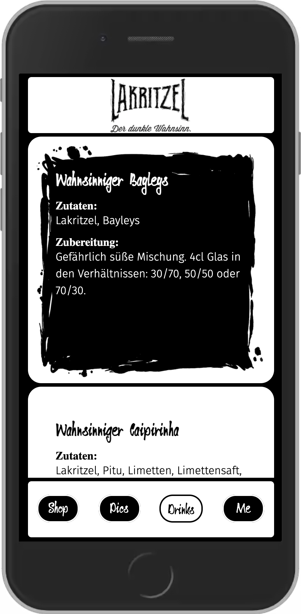

## Lakritzel Online-Shop

This will be the new Online-Shop for my sweet liquorice liquor named Lakritzel. WHAT?! You don`t know Lakritzel?! Then click in and find out.

This App is the capstone-project of my web development bootcamp @neuefische and is optimized for mobile usage only.

Stay tuned to see this and more upcomming andventures of the crazy black droplet.

## Demo

Have a look at Lakritzel on Vercel 👀

## Screenshots!

Lakritzel Online-Shop

## Tech Stack

React
HTML5
CSS3
Node.js
JavaScript
React Hooks
React Router
Styled Components
Storybook
React Testing Library
Vercel

## Project setup

Clone this repository.
Install all npm dependencies
npm install
To run the app in development mode npm start, then open http://localhost:3000 to view it in the browser
To run Storybook npm run storybook
To run unit and component tests npm test
to create a build ready for deploying: npm run build
